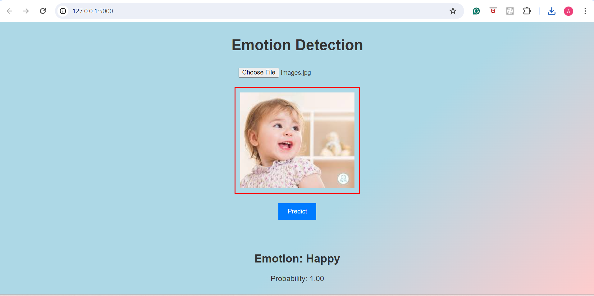

# Emotion Detection from Facial Expressions
# Data Set
Kaggle - https://www.kaggle.com/datasets/msambare/fer2013 The data consists of 48x48 pixel grayscale images of faces. The faces have been automatically registered so that the face is more or less centred and occupies about the same amount of space in each image.

Description: The dataset consists of 48x48 pixel grayscale images of faces, which have been automatically registered to ensure consistent centering and size. Each face is categorized based on the emotion shown in the facial expression into one of seven categories:
0: Angry
1: Disgust
2: Fear
3: Happy
4: Sad
5: Surprise
6: Neutral
Project Overview
The project aims to develop a machine learning model capable of detecting emotions from facial expressions using the FER2013 dataset. The steps involved in the project are as follows:

# Environment Setup

The project uses TensorFlow for model development.
Code includes setting up a TPU environment for accelerated training.
Installed necessary packages including opendatasets, numpy, pandas, matplotlib, cv2, and seaborn.
Data Preparation

# Downloaded the FER2013 dataset using opendatasets.
Extracted and listed the contents of the dataset.
Prepared the data for analysis, ensuring it is in a suitable format for model training.
Exploratory Data Analysis (EDA)

Analyzed the distribution of emotions in the dataset.
Visualized sample images for each emotion category.
Examined class imbalances and considered techniques to handle them.

# Model Development
Built and compared four different models:
Simple CNN Model
VGG16 with Transfer Learning
ResNet50 with Transfer Learning

Custom Deep Learning Model

Utilized techniques such as data augmentation to improve model performance.
Implemented and trained the models using TensorFlow and Keras.

Model Evaluation

Evaluated the performance of each model using metrics such as accuracy, confusion matrix, classification report, and ROC curves.
Compared the models based on their accuracy, precision, recall, and F1-score for each emotion category.

Observations

Class Imbalance: Noted a significant class imbalance in the dataset, with some emotions being underrepresented.

# Model Comparison:

Simple CNN Model: Served as a baseline with moderate performance.

VGG16 Transfer Learning: Improved performance due to pre-trained weights but required significant computational resources.

ResNet50 Transfer Learning: Achieved the best performance among all models with the highest accuracy (62%) and balanced results across all emotion categories.

Custom Deep Learning Model: Showed competitive performance but slightly lagged behind ResNet50.

Data Augmentation: Applying data augmentation techniques helped improve the model's robustness and performance.

# Conclusion
The project successfully developed and compared multiple models to detect emotions from facial expressions using the FER2013 dataset. The ResNet50 with transfer learning emerged as the best-performing model, achieving the highest accuracy and balanced performance across all emotion categories.

# webapp demo screenshot

# Future Recommendations
Address Class Imbalance: Implement techniques such as oversampling, undersampling, or class weighting to handle class imbalance more effectively.

Experiment with Advanced Architectures: Explore more advanced deep learning architectures and ensemble methods to further improve accuracy.

Hyperparameter Tuning: Perform extensive hyperparameter tuning to optimize model performance.

Incorporate Additional Data: Use additional datasets to enhance model training and generalization capabilities.
